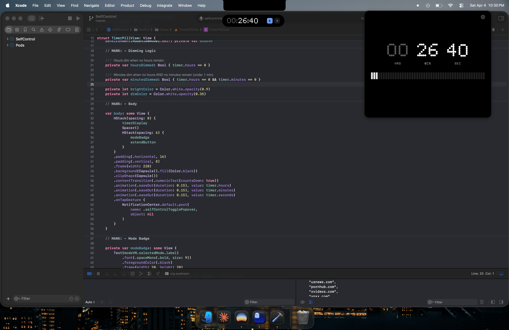

# SelfControl Mastered

<p align="center">
    
</p>

## About

SelfControl Mastered is a redesigned fork of SelfControl for macOS with a Nothing-inspired design system. Block your own access to distracting websites, mail servers, or anything else on the Internet. Set a duration, add sites to your blocklist, and start a block. Until the timer expires, you will be unable to access those sites — even if you restart your computer or delete the application.

### What's New

- **Nothing design system** — OLED black UI, Ndot 57 dot-matrix typography, Space Grotesk/Mono type stack
- **Floating timer pill** — capsule overlay with contextual digit dimming (faded zeros), mode badge, and extend button
- **Faded-zero countdown** — inactive time units dim automatically (hours fade when 0, minutes fade when under 1 min)
- **Block modes** — switch between different blocking configurations
- **Menu bar integration** — quick access popover from the menu bar

## Install

Download the latest `SelfControl-1.0.1.dmg` from the [Releases page](https://github.com/advegaf/selfcontrol-mastered/releases).

1. Open the DMG and drag **SelfControl** to the **Applications** folder.
2. Launch SelfControl from Applications.
3. On first run, SelfControl will ask for permission to install a small background helper that enforces blocks. Click **Open System Settings**, then enable the toggle next to SelfControl under **System Settings → General → Login Items & Extensions**.
4. Return to SelfControl. You're ready to start your first block.

The helper service is required because macOS isolates background processes — only an approved Login Item can keep your block running while the app is closed. This is a one-time setup.

## Credits

Remodeled by [Angel Vega](https://advegaf.com). Forked from [Charlie Stigler](http://charliestigler.com), [Steve Lambert](http://visitsteve.com), and [others](https://github.com/SelfControlApp/selfcontrol/graphs/contributors).

## License

SelfControl is free software under the GPL. See [this file](./COPYING) for more details.

## Building

Requires macOS 26.0+, Xcode 17+, and CocoaPods.

```bash
git clone https://github.com/advegaf/selfcontrol-mastered.git
cd selfcontrol-mastered
pod install
./build.sh
```

Or manually:

1. `pod install`
2. Open `SelfControl.xcworkspace` (not `.xcodeproj`)
3. Build and run

## Releasing

Maintainers only. Cuts a fully signed, notarized, and stapled DMG ready for distribution.

```bash
./release.sh
```

The script does a clean Release build, re-signs every embedded binary with hardened runtime + secure timestamp (stripping debug entitlements and re-signing the bundled Sparkle framework), notarizes and staples the `.app`, generates the Nothing-style DMG background image at 660×400 @2x retina, builds the DMG via `sindresorhus/create-dmg` and post-processes it (swaps the background TIFF and rewrites `.DS_Store` with a centered icon layout), then signs, notarizes, and staples the final DMG. Output: `dist/SelfControl-<version>.dmg`.

Run `REBUILD=1 ./release.sh` to force a fresh build (otherwise the script reuses the cached notarized `.app` from `dist/build/`).

**Prerequisites**:
- Developer ID Application certificate in your keychain
- Notarytool keychain profile named `selfcontrol-notary` — configure once with `xcrun notarytool store-credentials selfcontrol-notary --apple-id <id> --team-id DV483F72N3 --password <app-specific-password>`
- Node.js (for `npx create-dmg`) — `brew install node`
- Python `ds_store` and `mac_alias` — `pip3 install --user ds-store mac-alias`
