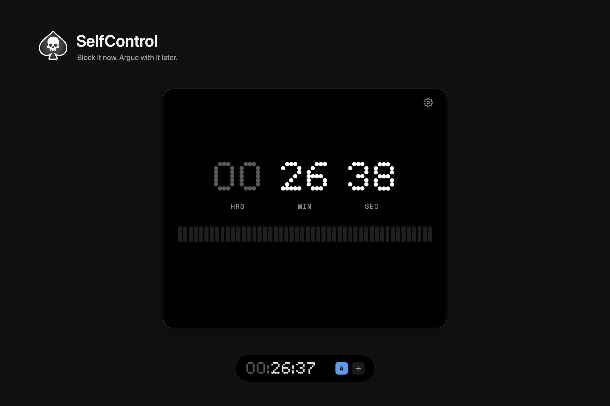
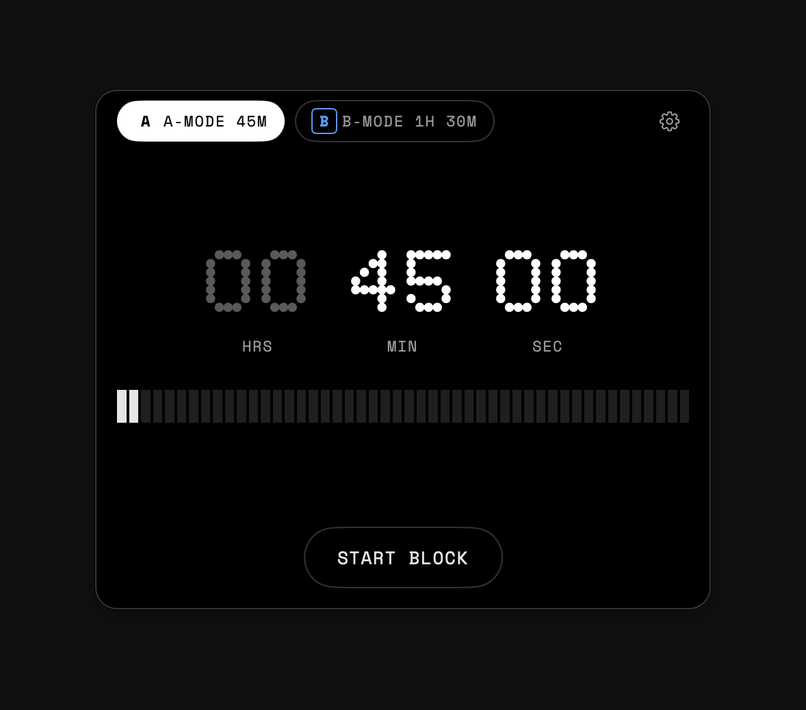
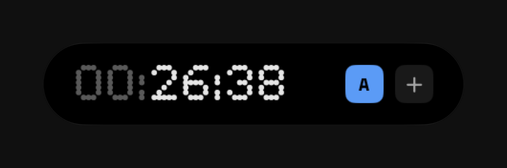
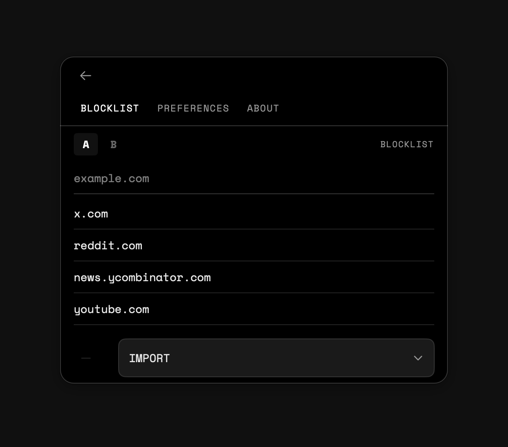

<p align="center">
  
</p>

<h1 align="center">SelfControl</h1>

<p align="center">
  Pick a list of sites and a length, start the block, and those sites are gone until the timer runs out. Quitting the app will not bring them back, and neither will deleting it or restarting the Mac.
</p>

<p align="center">
  
</p>

<p align="center">
  <a href="https://github.com/advegaf/selfcontrol-mastered/releases/latest"></a>
</p>

<p align="center">
  <sub>Signed, notarized, and free. Requires macOS 26.</sub>
</p>

Every app that blocks distractions has an off switch, because every app has a
quit command. SelfControl's answer, and it is the original one from 2009, is to
stop being an app at the moment it matters. Starting a block writes the rules
into the system's own hosts file and hands the clock to a background helper.
The app is then just a window onto something that is already happening.

This is a fork, and the blocking is upstream's: that part has been right for
fifteen years and is not worth rewriting. What is new here is everything you
look at.

## Install

Open the disk image and drag SelfControl into Applications. It is signed with a
Developer ID and notarized by Apple, so it opens on a normal double click.

On the first launch it asks to install the helper that enforces blocks, which
means approving SelfControl once under System Settings, General, Login Items &
Extensions. macOS keeps background processes at arm's length, and an approved
login item is the only kind that can hold a block open while the app is closed.
It is asked once.

Requires macOS 26.

## Starting one

<p align="center">
  
</p>

Drag the slider to a length and press Start Block. There is no pause button, no
cancel, and no unlock code, because a blocker with a way out is a blocker you
will use the way out on. What ends a block is the length you already chose.

A block can be extended while it runs and it cannot be shortened, which is the
one asymmetry the whole thing rests on.

## While it runs

<p align="center">
  
</p>

Close the window and a pill stays on screen with the countdown in it, the mode
it is running, and a button that adds time. It sits at the desktop level by
default, so it is there when you look for it and behind everything while you
work. Drag it wherever it belongs.

A unit that has run out dims rather than disappearing. Under an hour the hours
fade, under a minute the minutes go too, so the number that is still moving is
the brightest thing in the pill and you read it without reading the rest.

## Two lists, not one

<p align="center">
  
</p>

A and B each hold their own list, their own length, and their own choice about
whether the list blocks or is the only thing allowed. One for work and one for
the evening, and switching is a click rather than an edit.

Import fills a list from a preset rather than making you type one out: the
usual distractions, news, or the adult sites.

## Permissions

Nothing in the usual privacy list. SelfControl asks for no camera, no
microphone, no contacts, no screen recording and no accessibility, because
blocking a website needs none of them.

| What you use | What it asks for | Why |
| --- | --- | --- |
| Any block at all | An approved login item | The helper writes the hosts file and holds the clock, and macOS only lets an approved login item keep running once the app is closed |
| Installing the helper | Your admin password, once | Writing to the system hosts file is a root operation |

The login item is the whole permission story, and it is asked once rather than
on every launch. Nothing leaves the machine: there is no account, no analytics
and no network call in the app.

## Build it yourself

```sh
pod install
./build.sh          # build, install into /Applications, launch
```

It has to run out of `/Applications`: the helper's plist names an absolute
path, so a copy in a build directory cannot start a block.

`Tools/Screenshots/make-docs-images.sh` regenerates every image on this page.
`./release.sh` cuts a release: a clean build, Developer ID signing with a
hardened runtime, notarization, stapling, then the disk image, which is signed,
notarized and stapled in its own right.

## Credit

Redesigned by [Angel Vega](https://advegaf.com).

Forked from [SelfControl](https://github.com/SelfControlApp/selfcontrol) by
[Charlie Stigler](http://charliestigler.com),
[Steve Lambert](http://visitsteve.com) and
[everyone since](https://github.com/SelfControlApp/selfcontrol/graphs/contributors).
The blocking engine, the helper and the hosts file work are theirs.

The look is after [Nothing](https://nothing.tech): OLED black, Ndot 57 for the
dot-matrix digits, Space Grotesk and Space Mono for everything else.

## Licence

GPL, the same as upstream. See [COPYING](COPYING).
